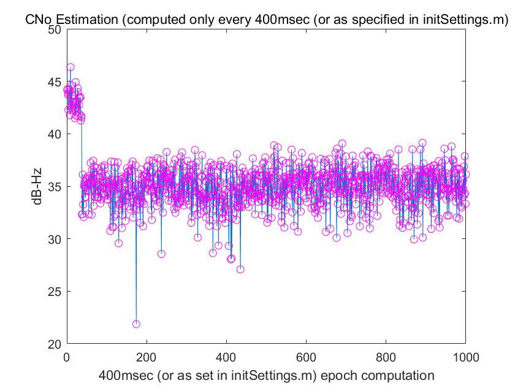

# Satellite-Communication-and-Navigation---Assignment-1

## Task 1 – Signal Acquisition

The initial phase of GNSS signal processing is **signal acquisition**, where Intermediate Frequency (IF) data is analyzed using a **GNSS Software-Defined Radio (SDR)**. The primary goal of this acquisition phase is to identify satellite signals and estimate their **coarse Doppler shift** and **code phase**. 

The outcomes of this process provide a preliminary evaluation of **signal availability**, which is crucial for ensuring that satellites can be effectively tracked in the later stages. The acquisition results of the two datasets are shown below.

### 1. Urban

### 2. Opensky

As seen above, **four** satellites can be acquired in the Urban dataset, while **five** satellites can be acquired in the Opensky dataset.

---

## Task 2 – Signal Tracking

The tracking phase focuses on adjusting the **tracking loop**, particularly the **Delay-Locked Loop (DLL)**, to maintain a consistent lock on satellite signals. This involves the use of **multiple correlators** to create correlation plots, facilitating a detailed assessment of tracking performance.

### 2.1 Evaluation of Tracking Performance

This section evaluates the **tracking performance** of various satellites based on:

- **Carrier-to-Noise Ratio (C/N₀)** – Provides insights into the strength and quality of the signals.
- **DLL discriminator outputs** – Reflects the accuracy of tracking.

Both metrics are vital for assessing the effectiveness of a GNSS receiver, especially in urban areas where **multipath effects** and **signal obstructions** are prevalent.

#### **C/N₀ Performance**
##### **Urban Dataset**

  
  

  
  

##### **Opensky Dataset**

  
  

  
  

#### **Correlation between C/N₀ and DLL Performance**
##### **Urban Dataset**

  
  

  
  

##### **Opensky Dataset**

  
  

  
  

---

### 2.2 Effects of Urban Interference on Correlation Peaks

Urban environments significantly hinder GNSS tracking due to several factors:

1. **Multipath Effects**
   - Signals reflecting off buildings create delayed versions that interfere with direct signals.
   - This results in **distorted correlation peaks**, leading to increased **DLL tracking errors**.

2. **Signal Blockage and Attenuation**
   - Obstructions from structures, trees, and tunnels cause **abrupt signal drops**.
   - Affected signals exhibit **erratic DLL outputs**, indicating poor tracking stability.

3. **Dynamic Signal Variations**
   - Moving receivers (e.g., vehicles) cause **sudden changes in signal strength**, resulting in **C/N₀ fluctuations**.
   - Satellites with high variability in **C/N₀** demonstrate **inconsistent tracking accuracy**.

---

## Task 3 – Decoding Navigation Data

After establishing tracking, the **navigation message** is decoded to extract essential parameters, including **ephemeris data**. This data provides accurate **satellite position** and **clock information**, which is critical for precise positioning.

At least one satellite's data has been successfully decoded, demonstrating the capability to retrieve key **orbital parameters** necessary for user position estimation.

### **Satellite (PRN 20) Data**
- **Satellite Position (X, Y, Z) in meters**:
  - **X**: `[150292, -1803699, -2309752, 610660, -2240428, -1005868, 1062324]`
  - **Y**: `[25408951, 1657080, 1334504, 2529012, 364135, 2070822, 1905366]`
  - **Z**: `[803555, 955353, 412700, -534250, 1375899, -1313148, 1488317]`
- **Satellite Clock Correction**: `0.000366` seconds
- **GPS Time**: `388458.0076751` seconds

---

## Task 4 – Estimating Position and Velocity

**Pseudorange measurements** obtained during the tracking phase are utilized in a **Weighted Least Squares (WLS)** algorithm to compute the **user's position and velocity**.

### **Comparison of Positioning Errors**

As seen in the above graphs:
- The **maximum error** in the **Urban area** is about **100m**, which is much higher than that in **open-sky areas (30m)**.

### **4.1 Discussion on Multipath Effects**
Multipath effects arise when **GPS signals reflect off nearby surfaces** (such as buildings, water, or terrain) before reaching the receiver. This leads to distortions in **pseudorange and Doppler measurements**, resulting in **positioning errors**. Below, we analyze how **multipath** impacts the **WLS solution** in both **open-sky** and **urban** environments.

#### **Multipath Effects in Open-Sky Conditions**
- The **error of estimation is minimal**.
- Multipath primarily arises from **ground reflection**.

#### **Multipath Effects in Urban Conditions**
- Urban settings introduce **significant multipath** due to reflections from buildings.
- **Pseudorange errors** can be substantial, often exceeding **tens of meters**.
- **Doppler shifts** may also be influenced, resulting in **errors in velocity estimation**.
- **Positioning accuracy** is considerably lower compared to open-sky conditions.

---

## Task 5 – Positioning with Kalman Filter

To **improve positioning accuracy**, an **Extended Kalman Filter (EKF)** is developed using **pseudorange** and **Doppler measurements**.

### **EKF Applied to the Urban Dataset**

Besides improving position accuracy, **velocity error** can also be **significantly decreased**.

---

## Conclusion

This document analyzed different stages of **GNSS signal processing**, including:

- **Signal Acquisition** – Identifying satellite signals.
- **Signal Tracking** – Evaluating **C/N₀** and **DLL performance**.
- **Navigation Data Decoding** – Extracting satellite parameters.
- **Position and Velocity Estimation** – Evaluating errors in **urban vs open-sky** conditions.
- **Kalman Filtering** – Enhancing positioning accuracy.

### **Key Takeaways**
✅ **Urban environments** introduce significant **multipath errors**.  
✅ **Opensky conditions** provide **better GNSS tracking** accuracy.  
✅ **Kalman Filtering** improves **position estimation & velocity tracking**.  

---

## References
- GNSS SDR Processing Techniques
- Weighted Least Squares (WLS) Algorithm
- Extended Kalman Filter (EKF) for GNSS Applications
